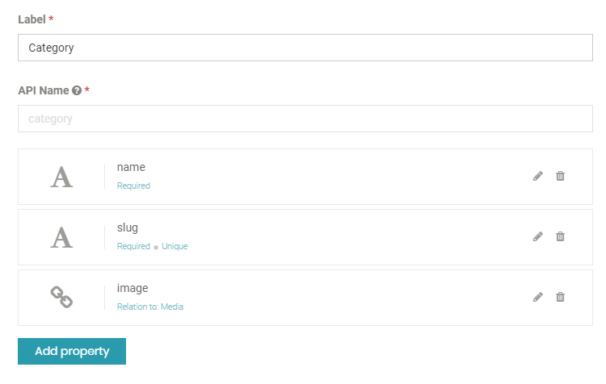
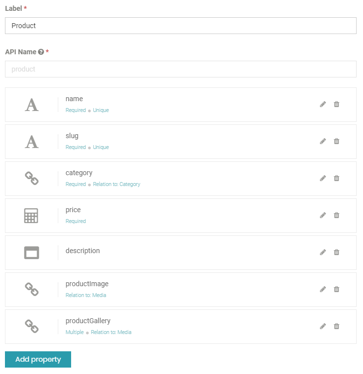
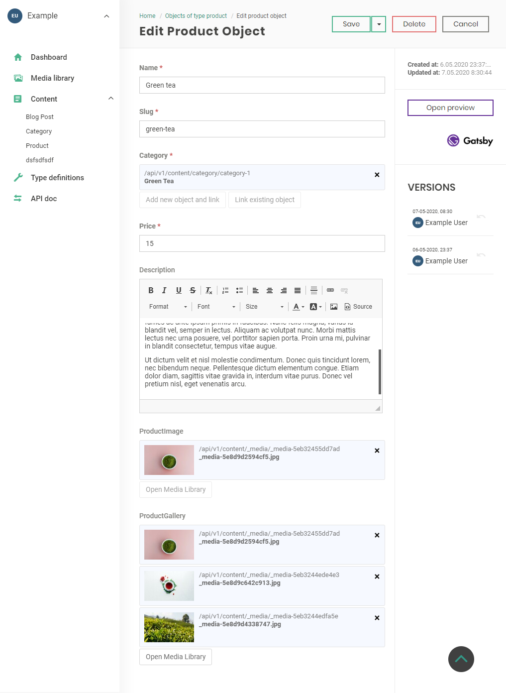
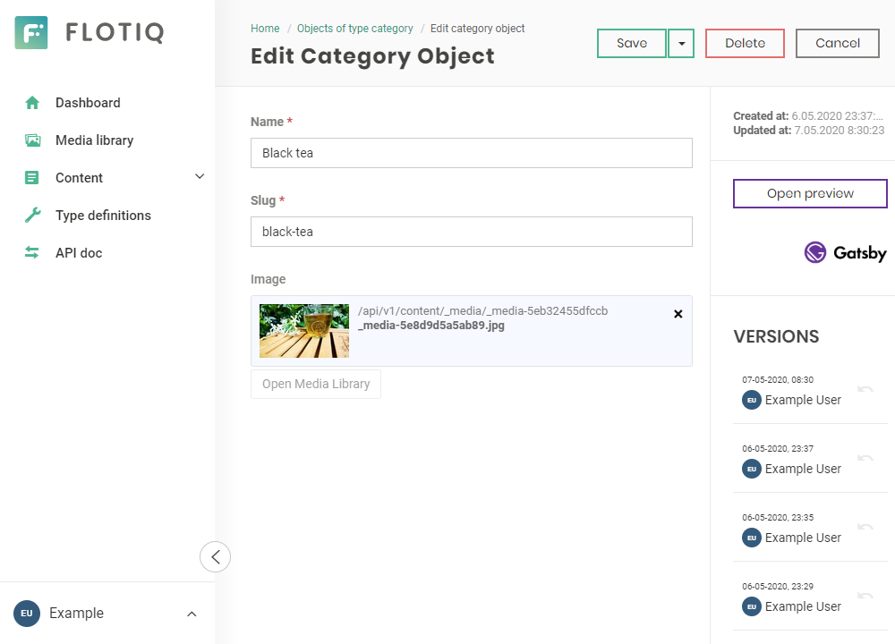

<a href="https://flotiq.com/">
    
</a>  
  
Gatsby Starter: Ecommerce and Flotiq, products with categories
========================


This is a [Gatsby](https://gatsbyjs.org) starter project for ecommerce using [Snipcart](https://snipcart.com). It's configured to pull products and categories data from [Flotiq](https://flotiq.com) and can be easily deployed to your cloud hosting - Heroku, Netlify, Gatsby Cloud, etc.

Live Demo: https://flotiq-starter-products.herokuapp.com

Screenshot


## Quick start

1. **Start project from template using Gatsby CLI**
    
    ```bash
    gatsby new gatsby-starter-products-with-categories https://github.com/flotiq/gatsby-starter-products-with-categories.git
    ```

1.  **Setup "Products" Content Type in Flotiq**

   Create your [Flotiq.com](https://editor.flotiq.com/register.html) account. 
   
   Next, create the `Category` and the `Product` Content Type:
   
   
   
   
   _Note: You can also create `Category` and `Product` using [Flotiq REST API](https://flotiq.com/docs/API/):_            
   
  
1.  **Configure application**

   The last step is to configure our application to know from where it has to fetch the data.
   You can also setup your Snipcart API_KEY to enable store functionality. 
   
   You need to create a file called `.env` inside the root of the directory, with the following structure:

   ```
   GATSBY_FLOTIQ_BASE_URL=https://api.flotiq.com
   FLOTIQ_API_KEY=YOUR FLOTIQ API KEY
   SNIPCART_API_KEY=YOUR SNIPCART PUBLIC API KEY
   ```

1.  **Start developing.**

    Navigate into your new site’s directory and start it up.
    
    ```sh
    cd gatsby-starter-products-with-categories
    npm install
    gatsby develop
    ```
      
    If you wish to import example products to your account, before running `gatsby develop` run:
      
    ```sh
    node ./example/importExample.js
    ```
    
    It will add 2 categories, 10 images and 4 products to your Flotiq account.
    
    _Note: You need to put your Read and write API key in `.env` for import to work. You don't need Category and Product content types in your account. If you already have products with ids `product-1`, `product-2`, `product-3`, and `product-4` or categories with ids `category-1` and `category-2` they will be overwritten._

1.  **Open the source code and start editing!**

    Your site is now running at `http://localhost:8000`!
    
    _Note: You'll also see a second link: _`http://localhost:8000/___graphql`_. This is a tool you can use to experiment with querying your data. Learn more about using this tool in the [Gatsby tutorial](https://www.gatsbyjs.org/tutorial/part-five/#introducing-graphiql)._
    
    Open a project directory in your code editor of choice and edit `src/pages/index.js`. Save your changes and the browser will update in real time!

1. **Manage your products using Flotiq editor**

    You can easily manage your products and categories using Flotiq editor
    
    
    
 

## Deploy

  You can deploy this project to Heroku in 3 minutes:

  [](https://heroku.com/deploy?template=https://github.com/flotiq/gatsby-starter-products-with-categories)

  Or to Netlify:

  [](https://app.netlify.com/start/deploy?repository=https://github.com/flotiq/gatsby-starter-products-with-categories)


## Collaborating

   If you wish to to talk with us about this project, feel free to hop on our [discord server](https://discord.gg/FwXcHnX).
   
   If you found a bug, please report it in [issues](https://github.com/flotiq/gatsby-starter-products-with-categories/issues).
